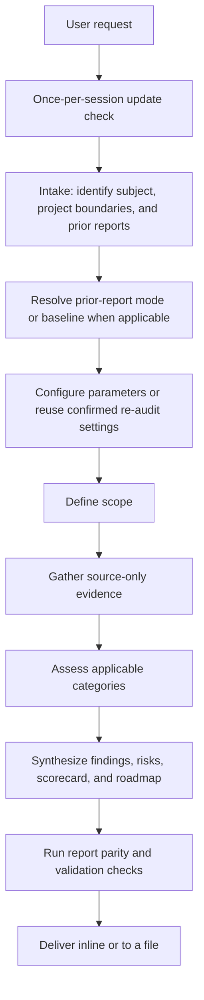

# Lens - Software Audit Skill

```
 /\_/\
( o.o )
 > ^ <
```

> Evidence-based engineering audits of any software subject - prototypes, codebases under
> development, and already-running production systems.
>
> [Versioning Policy](./VERSIONING.md)

## Contents

| Section                            | Line | What it covers                                      |
|------------------------------------|------|-----------------------------------------------------|
| Overview                           | 34   | Audit purpose and standard report shape             |
| What The Skill Does                | 65   | Update check, evidence, assessment, synthesis       |
| Installation                       | 121  | Clone and update instructions                       |
| Usage                              | 148  | Activation, parameters, and report delivery         |
| Example Prompts                    | 174  | Full and focused audit requests                     |
| Workflow Diagrams                  | 234  | ASCII and Mermaid audit pipelines                   |
| Evidence And Decision Quality      | 294  | Evidence strength and verification limits           |
| Core Principles                    | 346  | Evaluation constraints and status rules             |
| Report Format                      | 362  | Report structure, identifiers, and style            |
| When To Use This Skill             | 392  | Supported requests and exclusions                   |
| What's Inside                      | 412  | Documents, references, tools, and conditional files |
| Document Style                     | 501  | Pointer to the style rules file                     |
| Verification For Skill Maintenance | 510  | Maintenance checks and regression scenarios         |
| License                            | 530  | License for the skill itself                        |
| Credits                            | 536  | Authorship and attribution                          |

## Overview

Lens is a structured audit process packaged as an agent skill.

It guides an AI coding agent through a complete engineering assessment of any software subject - a
prototype, codebase under development, production system, or technical proposal - producing a
neutral, repeatable report anchored to concrete facts rather than impressions.

Unlike a generic "review my code" prompt, Lens enforces a fixed workflow: intake, parameter
configuration, scope definition, evidence gathering, per-category assessment, synthesis, and
validation.

The output is a standardized report with twenty-one baseline sections: Document Information, the
Audit Type Coverage & Assurance Matrix, Executive Summary, System Context (including the technology
stack), a source-derived Software Bill of Materials, License & IP Compliance Review, Health
Dashboard, Delivery Practice & Team Continuity, High-Level Observations, Auditing Methodology,
Scoring Rubrics, Architectural Assessment, Trade-off Analysis, Strengths & What's Working, Detailed
Technical Findings with theoretical exploitability narratives on serious security findings, Unified
Risk Register, Actionable Remediation Roadmap, Scope Exclusions, Limitations and Unknowns,
Validation Record, and References.

Conditional sections appear only when the subject warrants them: Data Flow Diagram, Design
Patterns, Architecture Decision Records, Threat Model, API Contract Conformance, Skill Definition
Conformance, AI System Assessment, Standards Conformance, API Compatibility & Versioning Discipline,
Technical Debt Register, Changes Since Previous Audit, and Re-audit Plan.

Every section uses a hybrid table-paragraph format for scannable summaries backed by detailed
evidence.

---

## What The Skill Does

When you ask for an audit, the agent loads the skill and performs the following:

**Checks for updates**

Once per session, the agent runs a git self-update check on the skill's own repository and offers
to pull incoming commits before starting, when the skill lives in a git clone.

**Reads everything you supplied**

Code, configuration, documentation, logs, and prior reports. It identifies the artifact type
(prototype, codebase, production system, or proposal) and records the source format.

**Configures parameters**

Asks whether to accept default parameters or configure the core report parameters. Detail level
defaults to `Detailed`, improvement suggestions default to a prioritized roadmap, trade-off
analysis defaults to a standalone section with embedded reasoning, and descriptive mode defaults
to enabled, adding a `Glossary` section that indexes every abbreviation used, describes
selected terms in depth, and is linked from every acronym occurrence in the report. Advanced
parameters can still be changed when explicitly specified.

**Defines scope explicitly**

Lists what is in scope and what is excluded. Marks unstated constraints as `NOT SPECIFIED` rather
than assuming industry norms.

**Gathers evidence before judging**

Collects concrete anchors - file paths, config keys, documented commands, pipeline steps - before
forming conclusions. Separates collection from judgment to avoid confirmation bias. The analysis
never builds, tests, or executes the project.

**Assesses across 18 categories**

Testing, design principles, code quality, stack best practices, dependencies, deployment, rollback,
maintainability, change management, documentation, non-functional requirements, security,
compliance, observability, error handling, operational readiness, AI-generated code detection and
provenance, and copyrights and originality. Each category receives one of five statuses: `PASS`,
`PARTIAL`, `FAIL`, `UNKNOWN`, or `N/A`. A conditional seventh pillar, API Compatibility & Versioning
Discipline, applies when the subject is a reusable library or package.

**Synthesizes findings**

Builds a unified risk register with bidirectional cross-referencing to findings, a 1-10
scorecard from category findings, and an actionable remediation roadmap with prioritized
impact-vs-effort tracking. Optional scales are `1-5`, `1-3`, `5 stars`, and `3 stars`.

**Produces a validated report**

Re-checks every finding against the evaluation rules: no assumptions, no personal judgment, no
emotional language, every claim anchored to a concrete fact.

---

## Installation

Lens is a filesystem-based Agent Skill.

Clone the repository and place the `lens-skill/` directory in your agent's configured skills
directory:

```bash
git clone https://github.com/zoltraks/lens-skill.git
```

### Updating

Once per session, Lens checks its own Git upstream.

If an update is available, it asks whether to pull or skip.

It pulls only when the repository is clean and a fast-forward is possible.

To update the clone manually:

```bash
git -C <skills-dir>/lens-skill pull --ff-only
```

---

## Usage

Lens activates when you request a software audit, architecture audit, prototype review, production
code audit, technical due diligence, readiness assessment, risk register, scorecard, or remediation
roadmap.

Name the software subject and the audit or assessment you want, such as an architecture audit,
production-readiness assessment, dependency review, or technical due diligence.

Before a new audit, Lens asks whether to accept the default parameters or configure the core report
settings.

A confirmed re-audit reuses the prior report's recorded parameters unless you request changes.

The report can be returned inline or written to a file, according to the resolved output location
and your choice.

Lens assesses software.

It does not implement changes.

The audit inspects repository contents and does not build, test, scan, or execute the audited
project.

---

## Example Prompts

**Full audit**
> Audit this production codebase. Produce a full engineering assessment with a unified risk
> register, scorecard, and actionable remediation roadmap.

**Audit to a file**
> Perform lens on this service and write the audit report to AUDIT.md. (The agent will accept
> the filename and ask whether to accept other defaults or configure core parameters.)

**Audit without a named file**
> Make audit report on this codebase. (The agent will ask whether to accept default parameters or
> configure core parameters, then offer inline, concrete file-location, and custom-file choices.)

**Readiness assessment**
> Is this system production-ready? Assess testing, deployment, rollback, observability, and
> operational readiness, and state the maturity level with evidence.

**Single dimension**
> Review only the security posture of this codebase. Mark anything you cannot determine from the
> provided files.

**SOLID and testability**
> Assess this codebase against SOLID principles and its testing strategy: test pyramid balance, TDD
> signals, and how testable the code is.

**Stack best practices**
> Review whether this code follows the idiomatic best practices of its stack: language idioms,
> framework conventions, ecosystem layout, and any deprecated APIs.

**Dependency and supply-chain audit**
> Audit the dependencies of this project: flag outdated and vulnerable packages, license
> compatibility, and whether builds are locked and reproducible.

**Risk register**
> Build a risk register for this architecture proposal. Use Low / Medium / High / Critical
> severities and tie each risk to evidence.

**Architectural trade-off**
> Evaluate the trade-off between keeping in-memory state versus introducing an external store for
> this prototype, given a single-instance target. Include a standalone trade-off table and embed the
> analysis into the relevant architectural finding.

**Re-audit**
> Re-run the audit on this codebase after the latest fixes. (The agent finds the previous report,
> asks you to confirm it as the re-audit baseline or choose a fresh audit instead, then writes a
> new revision-numbered file such as `AUDIT-1.1.md` without overwriting it and adds a Changes
> Since Previous Audit section.)

**Thin input**
> Here is a one-paragraph description of a service. Audit what you can and list exactly what
> additional artifacts would raise confidence.

**Skill definition audit**
> Audit this Agent Skill for spec conformance. Check the SKILL.md frontmatter against the Agent
> Skills specification, verify all file references resolve, and assess whether the description
> triggers correctly.

---

## Workflow Diagrams

The diagrams show the audit pipeline from the session update check through report delivery.

The audit uses inspected repository contents as evidence and never executes the audited project.

### ASCII Workflow

```
User request
    |
    v
Once-per-session update check
    |
    v
Intake: identify subject, project boundaries, and prior reports
    |
    v
Resolve prior-report mode or baseline when applicable
    |
    v
Configure parameters or reuse confirmed re-audit settings
    |
    v
Define scope
    |
    v
Gather source-only evidence
    |
    v
Assess applicable categories
    |
    v
Synthesize findings, risks, scorecard, and roadmap
    |
    v
Run report parity and validation checks
    |
    v
Deliver inline or to a file
```

### Mermaid Workflow



---

## Evidence And Decision Quality

Lens separates inspected source, executed checks, reported claims, and inference.

Every audit records a verification plan and evidence ledger with revision, documented command or
source, declared tool or report version, recorded result when one exists in the repository,
artifact, and limitations, including checks that were not run.

The audit inspects repository contents only. It never builds, tests, or executes the project, and
tool availability is not assumed. Documented or committed check results count as reported
evidence, not verification.

Serious findings receive a counter-check for reachability, existing guards, and alternative
explanations before they reach the executive summary.

Security findings use justified CWE mappings and CVSS vectors where applicable, while engineering
and business risks retain the Lens risk matrix. Each CWE-classified finding also names the
equivalent static-analyzer rule for the detected stack, per `references/cwe-analyzer-map.md`,
so follow-up verification is concrete.

Audits select canonical, stack-specific references from `references/stack-standards.md` rather
than relying on generic standards alone. Dependency manifests and lockfiles yield a
source-derived component inventory per `references/dependency-manifests.md`, with no tool
execution. Every overall score is reported with its lowest-scoring dimension alongside the
mean, and every material piece of collected evidence must surface in the report.

The guides cover how to assess documented or committed evidence for baseline checks, coverage,
mutation and fuzz testing, unsafe-use statistics, dependency advisories, SBOMs, and license
policies across stacks.

A clean scan is not proof of security, and a source-only audit is not runtime verification.

The quality crosswalk uses ISO/IEC 25010:2023 without claiming ISO certification.

ASVS 5.0.0, OWASP Top 10:2025, API Top 10:2023, and RFC 9457 are applied only where relevant,
with versions and coverage recorded and publication status checked at audit time.

Technical due diligence includes support continuity, operating costs, roadmap feasibility, supplier
risk, IP rights, and data lifecycle evidence through the existing categories.

Missing business inputs remain visible rather than being filled with invented budgets or owners.

Operational reviews distinguish SLO targets from measured results and use the current five-metric
DORA model when production delivery data is available.

Remediation costs use supported ranges and disclose unestimated work, common work is counted once.

Unknown authorship stays unknown, tidy code and uniform tests are not AI-origin evidence.

Production sign-off remains pending when required verification or confirmed ownership is missing,
even when the scoped report is final.

## Core Principles

Every audit follows these non-negotiable rules:

- **Evidence only** - findings trace to a concrete fact: a file, a config value, a command, a log
  line.
- **No assumptions** - missing information is marked `UNKNOWN`, `NOT SPECIFIED`, or
  `INSUFFICIENT INFORMATION`.
- **No personal judgement** - the report evaluates the system, never the people who built it.
- **Architectural neutrality** - choices are judged within stated constraints, not against a favored
  stack.
- **Contextual applicability** - categories that cannot apply to the deployment model are marked
  `N/A` with justification, not treated as failures.

---

## Report Format

The skill uses a hybrid table-paragraph format throughout:

- **Tables** provide scannable summaries with one to three words per cell.
- **Paragraphs** below each table provide detailed evidence, file paths, and reasoning.
- **Finding IDs** are shown as `FND-[PILLAR]-[001]` in the detailed findings section.
- **Risk IDs** are shown as `RSK-[001]` and cross-referenced to source findings.
- **Recommendation IDs** are shown as `REC-[001]` and traced to specific findings.
- **Scores** use `Score: 7/10` for the default scale, `Score: X/5` or `Score: X/3` for
  alternate numeric scales, and a star bar for star scales.

  ```
  Score: ★★★★☆
  Score: ★★☆
  ```

- **Severities** are shown as `SEVERITY: CRITICAL` inline after the finding title. Severity,
  status, and execution-state tokens localize per the report language's `translation/` file.
- **High-Level Observations** provide a fast-skim path for non-technical readers.
- **Strengths & What's Working** balances the tone with 5-8 acknowledged positives.
- **Trade-off Analysis** surfaces architectural tensions in a dedicated table.
- **Document style** - generated reports follow the same Markdown rules as the skill's documents:
  `#`/`##`/`###` headings only, one-sentence paragraphs, prose wrapping at a selectable width
  (default 100), and tables aligned by a temporary formatting script.

This format keeps the report readable in plain-text consoles while preserving depth.

---

## When To Use This Skill

| Situation                                        | Use this skill?                                     |
|--------------------------------------------------|-----------------------------------------------------|
| "Audit the architecture of this system"          | **Yes**                                             |
| "Audit this production codebase"                 | **Yes**                                             |
| "Review this prototype for production readiness" | **Yes**                                             |
| "Do technical due diligence on this codebase"    | **Yes**                                             |
| "Audit our dependencies and supply chain"        | **Yes** - use `assessment/dependency-review.md`     |
| "Build me a risk register and scorecard"         | **Yes**                                             |
| "Review only the security posture"               | **Yes** - single-dimension audit                    |
| "Check if this code is idiomatic for its stack"  | **Yes** - use `assessment/best-practices.md`        |
| "Audit this skill for spec conformance"          | **Yes** - use `assessment/skill-definition.md`      |
| "Check conformance with our dev standards"       | **Yes** - use `assessment/standards-conformance.md` |
| "Compare these two architectural options"        | **Yes** - embed trade-offs into relevant findings   |
| "Write the feature for me"                       | No - this skill assesses, it does not build         |
| "Tell me which team member caused this"          | No - this skill never evaluates people              |

---

## What's Inside

```
lens-skill/
├── SKILL.md                       # Root router - load this first
├── STYLE.md                       # Document style rules for all files in this skill
├── MAINTENANCE.md                 # Repository structure, registration, and validation policy
├── VERSIONING.md                  # Skill versioning policy
├── evals/
│   └── evals.json                 # Skill-creator behavioral regression prompts
├── principles/
│   ├── evaluation-rules.md        # Evidence-only, no assumptions, neutrality, status markers, constraints
│   └── output-style.md            # Tone, fixed vocabularies, consistency, determinism
├── process/
│   ├── audit-workflow.md          # Intake, scope, evidence, assessment, synthesis, validation
│   ├── report-format.md           # The table-driven, unnumbered report template
│   ├── report-parity.md           # Mandatory core checklist and consistency gate before Final
│   └── readiness-and-scoring.md    # Deterministic scores, confidence, maturity, and readiness gates
├── assessment/
│   ├── testing-review.md          # Test pyramid (unit/integration/e2e), TDD, coverage, testability
│   ├── design-principles.md       # SOLID, cohesion and coupling, DRY, separation of concerns
│   ├── code-quality.md            # Static analysis, type safety, complexity, duplication, dead code
│   ├── best-practices.md          # Stack idioms, framework conventions, ecosystem layout, deprecated APIs
│   ├── dependency-review.md       # Dependency freshness, vulnerabilities, licenses, lockfiles, SBOM
│   ├── deployment-review.md       # Build pipeline, release process, frequency, manual steps
│   ├── rollback-review.md         # Rollback mechanism, deploy safety, versioning
│   ├── maintainability-review.md  # Modularity, coupling, structure, technical debt
│   ├── change-management.md       # Feature flags, ADRs, release governance
│   ├── documentation-review.md    # Entry, API, inline docs, onboarding, knowledge transfer
│   ├── nfr-review.md              # Performance, scalability, availability, reliability, resilience
│   ├── security-review.md         # Auth, authorization, input validation, OWASP, data exposure
│   ├── compliance-review.md       # Data protection, privacy, regulatory scope, licensing, audit trail
│   ├── observability-review.md    # Logging, metrics, tracing, alerting
│   ├── error-handling.md          # Exceptions, retries, fallbacks, user-facing errors
│   ├── operational-readiness.md   # Runbooks, on-call, capacity, backups, incident response
│   ├── ai-generated-code.md       # Explicit provenance, generated-artifact validation, SDLC evidence
│   ├── ai-system.md              # (conditional) AI lifecycle, evaluation, safety, and provenance
│   ├── copyright-review.md        # Code originality, license compliance, attribution
│   ├── data-flow.md               # (conditional) DFD, trust boundaries, inter-process flows
│   ├── design-patterns.md         # (conditional) GoF/POSA pattern fitness and anti-patterns
│   ├── threat-model.md            # (conditional) STRIDE threat enumeration per trust boundary
│   ├── api-contract.md            # (conditional) API spec conformance, RFC 9457, OWASP API Top 10
│   ├── skill-definition.md        # (conditional) Agent Skills spec conformance, frontmatter, progressive disclosure
│   ├── standards-conformance.md   # (conditional) Project development standards conformance and quality
│   └── api-compatibility.md       # (conditional) API compat gates, versioning, breaking-change tracking
├── synthesis/
│   ├── risk-register.md           # Unified risk register with FND cross-referencing
│   ├── project-scorecard.md       # Project scorecard, rubric, and scale display rules
│   ├── trade-off-analysis.md      # Engineering trade-offs in standalone table and embedded findings
│   ├── remediation-roadmap.md     # Actionable remediation roadmap with priority matrix
│   ├── debt-register.md           # (conditional) TDR inventory with CISQ/SQALE cost model
│   ├── re-audit-plan.md           # (conditional) Verification ownership, sign-off gates, re-audit triggers
│   └── report-comparison.md       # (conditional) Previous report discovery, revisions, comparison
├── references/
│   ├── stack-standards.md         # Stack, supply-chain, and AI reference sources
│   ├── cwe-analyzer-map.md        # CWE to static-analyzer-rule cross-reference per ecosystem
│   ├── dependency-manifests.md    # Text-only manifest readers, source-derived component inventory
│   ├── census-commands.md         # Canonical reproducible census methods
│   ├── audit-taxonomy.md          # Canonical audit types, coverage statuses, source corpus
│   ├── sbom-schema.md             # Report-level source-derived component inventory schema
│   ├── license-compliance-checklist.md  # License classes, copyleft, notices, ownership checks
│   ├── delivery-practice-methodology.md # DORA proxies, bus-factor rubric, continuity evidence
│   └── exploitability-narrative-template.md  # Theoretical attack-path narrative format and tiers
├── tools/
│   ├── format-table.py            # Source-width Markdown table formatter
│   ├── validate-report.py         # Report structure and traceability validator
│   ├── validate-skill.py          # Dependency-light Agent Skill validator
│   ├── check-references.py        # Relative-reference integrity checker
│   ├── check-update.py            # Git upstream self-update checker for the skill repo
│   └── README.md                  # Tool usage, safety, and cleanup rules
└── translation/
    └── polish-language.md         # Polish rendering: vocabulary, terminology dictionary, headings, prompt phrasing, style rules
```

The `tools/` scripts are report-production and skill-maintenance utilities.

They do not build, test, scan, or execute the audited project.

Copy report-production scripts into the audited repository's `work/` directory under a `.tmp.` name.
Use an existing `temp` or `temporary` directory when `work/` is unavailable, and use the repository
root only when none exists. Run them only against report artifacts and remove the copies after use.

Sections marked *(conditional)* appear in a report only when the subject warrants them. A system
with no API gets no API Contract section, a single-user local utility with no trust boundary gets no
Threat Model. The inclusion criteria are defined in the Conditional Sections table of
`process/report-format.md`.

---

## Document Style

Every document that is part of this skill must follow the rules specified in [STYLE.md](./STYLE.md).

That file compiles Markdown text style, table formatting, and Agent Skills document requirements
into a single reference.

---

## Verification For Skill Maintenance

This repository contains Markdown instructions, not an application build or an automated model
benchmark suite.

When changing the skill, follow `MAINTENANCE.md` and:

- Run `git diff --check` to detect whitespace errors.
- Check frontmatter lengths, skill name, unchanged version, and root-router references.
- Format edited tables using an automated source-width formatter per `STYLE.md`.
- Check Contents tables in files over 300 lines and preserve encoding and line endings.
- Review router, workflow, templates, synthesis guides, and translations for agreement.
- Exercise the regression scenarios in `process/audit-workflow.md` and record limitations.

Name temporary validation scripts with a `.tmp.` infix, place them in `work/` when it exists and in
the repository root otherwise, and remove them after use.

Structural checks do not prove that future agents will follow the instructions, a fresh audit or
independent model evaluation is a separate behavioral verification step.

## License

MIT - see [LICENSE](./LICENSE).

---

## Credits

Built by Filip Golewski.

If you use this skill in a project, a link back is appreciated but not required.
